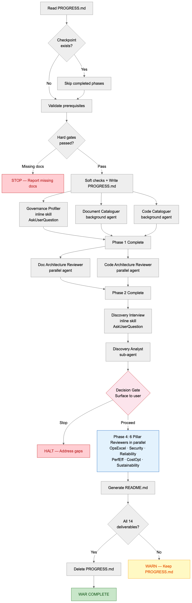
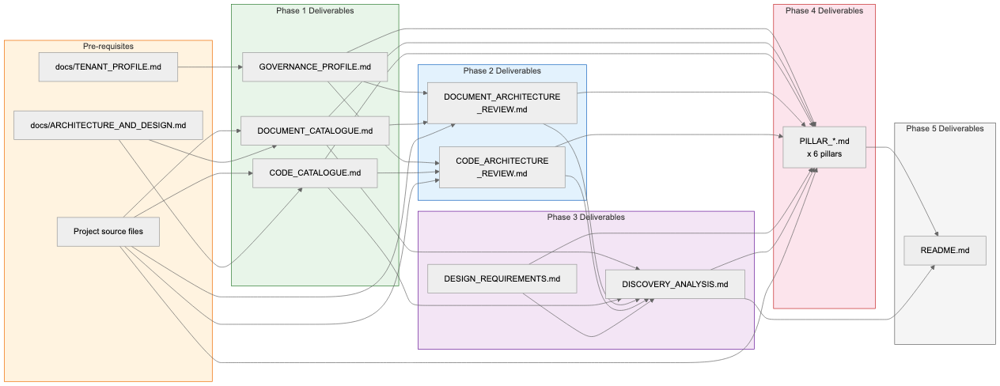
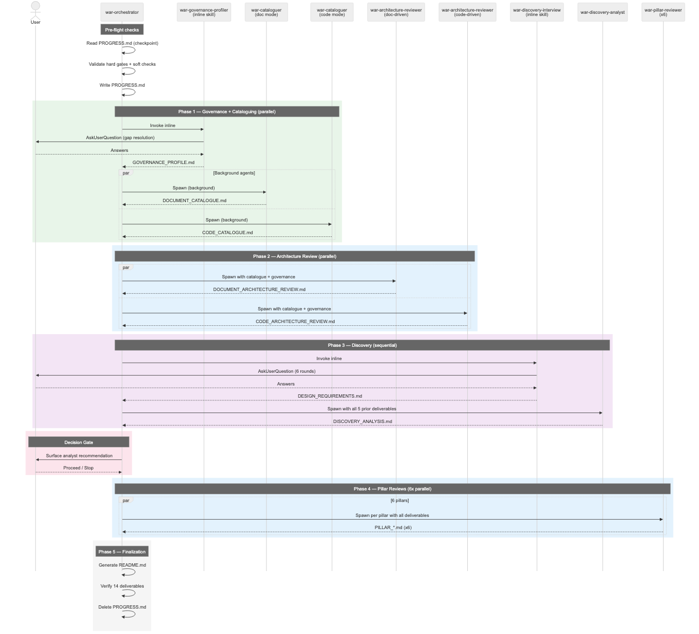
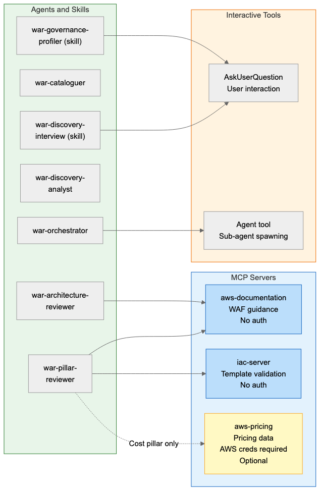

# Agent Flows: AWS Well-Architected Review Solution Kit

Companion to [ARCHITECTURE_AND_DESIGN.md](ARCHITECTURE_AND_DESIGN.md). This document focuses on agent orchestration, data flow between phases, and runtime behavior. The architecture doc covers component specifications, design decisions, and deployment — this doc covers how the pieces move at runtime.

## Orchestration Flow

How the orchestrator drives the 5-phase workflow. Includes checkpoint resume, pre-flight validation, parallel/sequential execution, decision gate, and finalization with cleanup.

- **Inline skills** (governance profiler, discovery interview) run in the orchestrator's context because they require `AskUserQuestion` for user interaction.
- **Background/parallel agents** (cataloguers, reviewers, pillar reviewers) are spawned via the Agent tool and run concurrently.
- **Stop points**: pre-flight hard gate failure (missing prerequisite docs) and decision gate (user chooses to halt).



### Phase Execution Model

| Phase | Execution | Agent Count | Why |
|-------|-----------|:-----------:|-----|
| Pre-flight | Sequential | 0 | Validation logic, no agents needed |
| Phase 1 | Mixed | 2 background + 1 inline | Governance profiler needs AskUserQuestion (inline); cataloguers are independent (parallel background) |
| Phase 2 | Parallel | 2 | Both reviewers read from Phase 1 outputs, no interaction needed |
| Phase 3 | Sequential | 1 inline + 1 agent | Interview must complete before analyst can cross-reference its output |
| Decision Gate | Sequential | 0 | Orchestrator reads analyst output, surfaces to user |
| Phase 4 | Parallel | 6 | All pillar reviewers read the same inputs, no cross-pillar dependencies |
| Phase 5 | Sequential | 0 | Orchestrator generates README, verifies deliverables, deletes progress tracker |

## Data Flow

How deliverables flow between phases. Each phase reads outputs from prior phases — documents are the interface between agents. No agent-to-agent communication occurs; all context passes through files.



### Deliverable Dependency Matrix

Which deliverables each agent reads as input.

| Agent | Reads | Writes |
|-------|-------|--------|
| war-governance-profiler | TENANT_PROFILE.md | GOVERNANCE_PROFILE.md |
| war-cataloguer (docs) | Project source files | DOCUMENT_CATALOGUE.md |
| war-cataloguer (code) | Project source files | CODE_CATALOGUE.md |
| war-architecture-reviewer (doc) | DOCUMENT_CATALOGUE.md, GOVERNANCE_PROFILE.md, source files | DOCUMENT_ARCHITECTURE_REVIEW.md |
| war-architecture-reviewer (code) | CODE_CATALOGUE.md, GOVERNANCE_PROFILE.md, source files | CODE_ARCHITECTURE_REVIEW.md |
| war-discovery-interview | Prior deliverables (read-only, for context) | DESIGN_REQUIREMENTS.md |
| war-discovery-analyst | All 5 prior deliverables | DISCOVERY_ANALYSIS.md |
| war-pillar-reviewer (x6) | All 7 prior deliverables + source files | PILLAR_*.md |
| war-orchestrator (Phase 5) | All pillar reviews + DISCOVERY_ANALYSIS.md | README.md |

### Key Data Flow Properties

- **Accumulative**: each phase adds deliverables; later phases read all prior outputs
- **Immutable**: the orchestrator never modifies sub-agent outputs
- **File-based**: all inter-agent communication is through markdown files in `docs/well-architected-review/`
- **Resumable**: PROGRESS.md tracks phase completion; the orchestrator skips phases whose deliverables already exist

## Agent Sequence

Timeline view of the orchestrator spawning agents and skills. Shows the interaction pattern: when the orchestrator talks to the user (via inline skills) versus when it delegates to background agents.



### Interaction Points

The user is involved at three points during the workflow:

| Point | Mechanism | Purpose |
|-------|-----------|---------|
| Phase 1: Governance Profiler | AskUserQuestion (up to 3 rounds) | Resolve ambiguities in TENANT_PROFILE.md — unclear control ownership, missing governance details |
| Phase 3: Discovery Interview | AskUserQuestion (6 structured rounds) | Capture business objectives, workload characteristics, compliance, security, performance, cost requirements |
| Decision Gate | AskUserQuestion (1 round) | User reviews analyst recommendation (proceed/stop) and makes the final call |

All other phases run without user interaction. The orchestrator reports phase completion status between phases but does not pause for confirmation.

## MCP Server Access

Which agents connect to which MCP servers, and which tools require user interaction. Agents without MCP access (orchestrator, cataloguers, analyst) operate purely on local file reads.



### MCP Server Details

| Server | Distribution | Used By | Purpose |
|--------|-------------|---------|---------|
| aws-documentation | .mcp.json (project-scoped) | architecture reviewer, pillar reviewer | WAF pillar guidance from public AWS docs |
| iac-server | .mcp.json (project-scoped) | pillar reviewer | CloudFormation/CDK template validation |
| aws-pricing | Inline in agent prompt (optional) | pillar reviewer (Cost pillar only) | Real pricing data for cost findings |

### Access Control Design

- **No MCP for orchestrator**: delegates all MCP-dependent work to sub-agents
- **No MCP for cataloguers**: pure file-scanning agents, no external data needed
- **No MCP for analyst**: cross-references existing deliverables only
- **Project-scoped for required servers**: `.mcp.json` makes aws-documentation and iac-server available session-wide
- **Inline for optional server**: aws-pricing is defined in the pillar reviewer prompt, scoped to that agent only, and requires AWS credentials

## Checkpoint and Resume

The orchestrator maintains `PROGRESS.md` as a phase-level checkpoint. This enables recovery from context window limits, errors, or deliberate pauses.

### Resume Behavior

```
Orchestrator starts
  |
  v
Read PROGRESS.md
  |
  +--> Does not exist: start from pre-flight (Step 1)
  |
  +--> Exists: parse progress table
         |
         For each phase marked [x]:
           verify deliverable files exist
           |
           +--> All exist: skip phase
           +--> Any missing: re-run phase
         |
         Resume from earliest incomplete phase
```

### PROGRESS.md Lifecycle

1. **Created** in pre-flight (Step 1) with all phases marked `[ ]`
2. **Updated** after each phase: `[~]` on start, `[x]` on completion, with timestamps
3. **Gate decision recorded** after the decision gate (recommendation + user choice)
4. **Deleted** in Phase 5 after all 14 deliverables are verified
5. **Retained** only if deliverables are missing (debugging aid)
